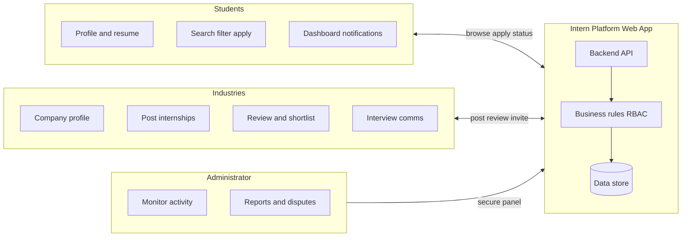
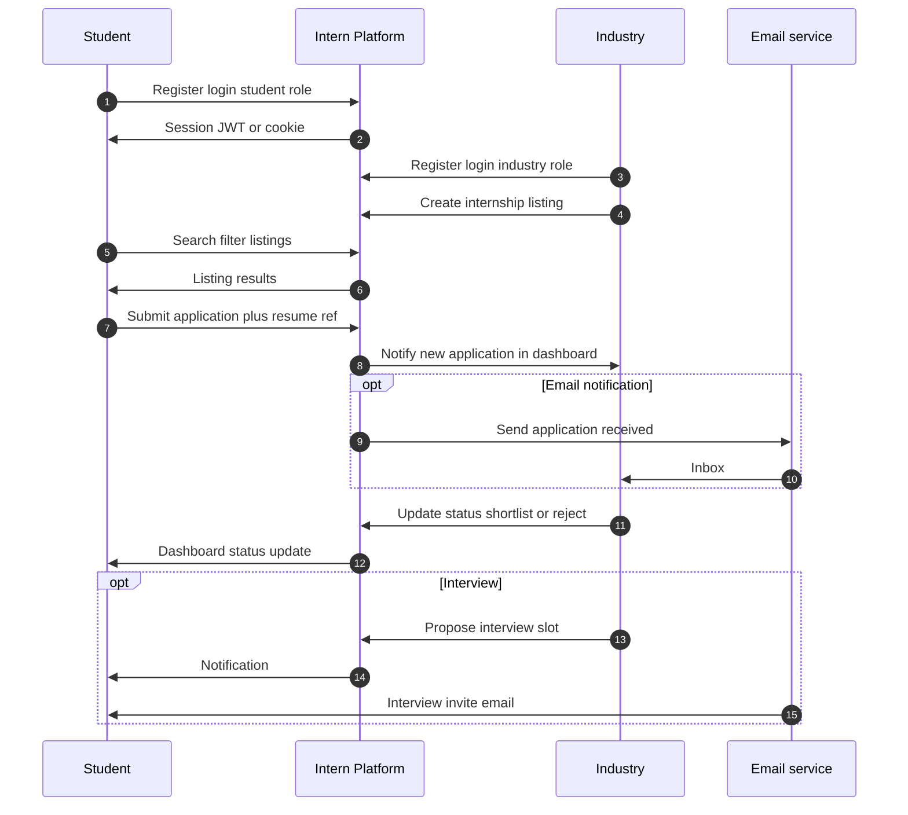
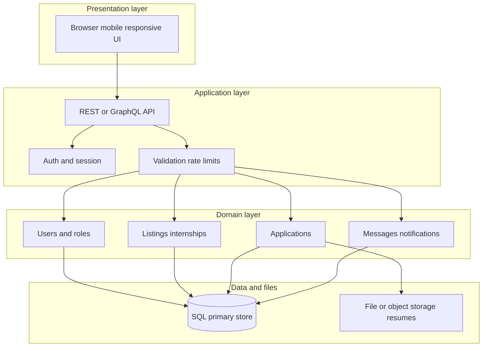
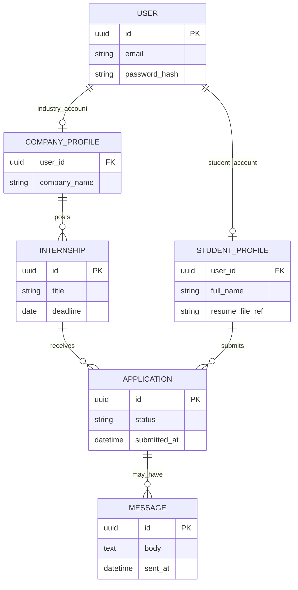
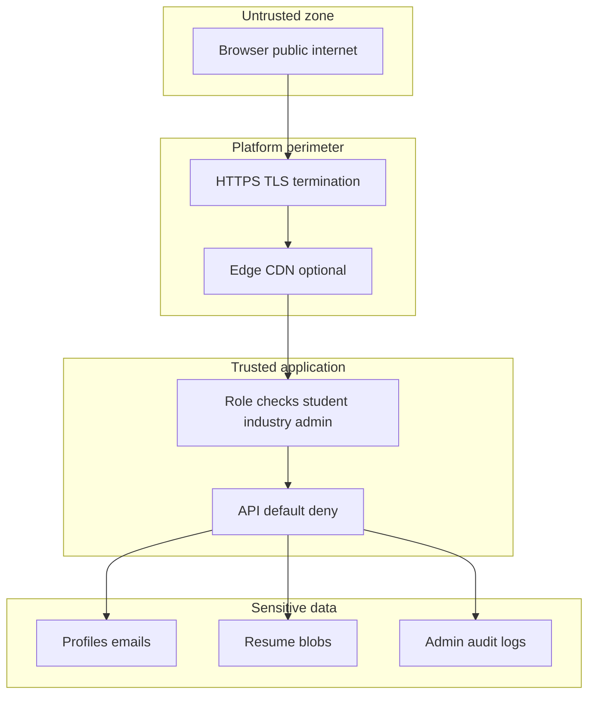
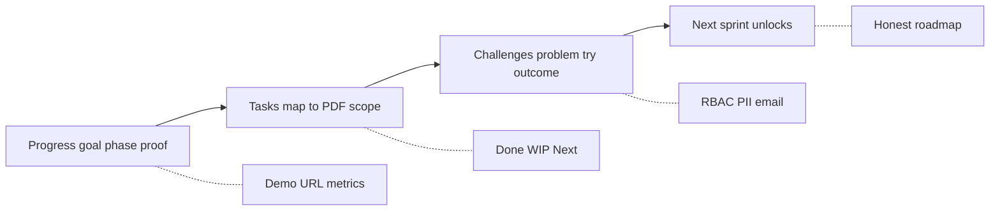
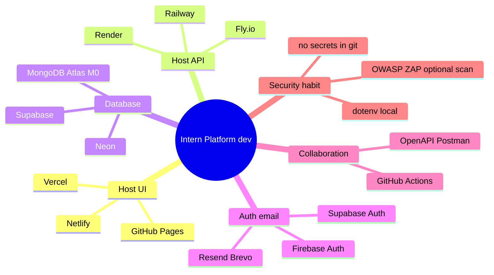

<div align="center">

# Tamilselvan S

**Ethical Hacker & Cybersecurity Specialist**


*Internship project documentation — Industry Web Application: Intern Platform*

</div>

---

## About the author

**Tamilselvan S** works at the intersection of **ethical hacking**, **defensive security**, and **secure software delivery**. This document records the full **Intern Platform** scope (from the official task specification), implementation-oriented notes, and a structured way to present **progress**, **completed work**, and **challenges** during internship reviews. Security and privacy requirements from the spec are highlighted so they align with a cybersecurity-focused mindset.

**Profile image URL (source):**  
https://github.com/Tamilselvan-S-Cyber-Security/Tamilselvan-S-Cyber-Security/raw/main/images/1747757610488-photoaidcom-cropped.png

**GitHub organization / profile (from asset path):**  
https://github.com/Tamilselvan-S-Cyber-Security

---

## Table of contents

1. [Project overview](#1-project-overview)
2. [Full project scope (task document)](#2-full-project-scope-task-document)
3. [Actors and main flows](#3-actors-and-main-flows)
4. [Suggested technical architecture (reference)](#4-suggested-technical-architecture-reference)
5. [Security, privacy, and ethical-hacking alignment](#5-security-privacy-and-ethical-hacking-alignment)
6. [Presentation guide: progress, tasks, challenges](#6-presentation-guide-progress-tasks-challenges)
7. [Detailed scope checklist (interview / Q&A)](#7-detailed-scope-checklist-interview--qa)
8. [Visual diagrams (Mermaid)](#8-visual-diagrams-mermaid)
9. [Related files in this workspace](#9-related-files-in-this-workspace)

---

## 1. Project overview

**Working title:** Developing an **Internship Connection with Industry** web application (**Intern Platform**).

**Goal:** Build a web application that connects **students** seeking internships with **industries** that offer relevant opportunities.

**In one sentence:** Students can **browse and apply**; industries can **post roles and review applications**; the platform supports **notifications**, **communication**, and **administrative oversight**, with emphasis on **security** and a **strong user experience**.

---

## 2. Full project scope (task document)

Below is the scope as defined in the **Intern Platform** task document (summary of all major areas).

### 2.1 User registration and authentication

- Implement **user registration** for **both students and industries**.
- Implement **authentication mechanisms** so access to the application is **secure** and **role-appropriate**.

### 2.2 Student features

- **User-friendly interface** for students to create **profiles** and **upload resumes**.
- Ability to **search and browse** available internship opportunities.
- **Filtering** by **location**, **industry**, **duration**, and other relevant criteria.
- Mechanism to **apply for internships** directly through the web application.
- **Student dashboard** to **track applications** and receive **notifications** on **application status**.

### 2.3 Industry features

- **Intuitive interface** for industries to **register** and create **profiles**.
- Ability to **post internship opportunities**, including **job descriptions**, **requirements**, and **application deadlines**.
- **Review and selection** workflow to **manage received applications**.
- **Communication** support so industries can **contact** and **schedule interviews** with selected candidates.

### 2.4 Admin panel

- **Admin panel** with **secure access** for administrators.
- Tools to **monitor user activities**, **review reported content**, and handle **disputes**.

### 2.5 Notifications and communication

- **Email notifications** for students and industries regarding **application status**, **interview invitations**, and other important updates.
- **In-app messaging** between students and industries where required by the product design.

### 2.6 User experience and design

- **Appealing and intuitive** user interface.
- **Responsive** design compatible with **different devices and screen sizes**.

### 2.7 Security and privacy

- **Secure authentication** and **encryption** mechanisms to protect user data and prevent **unauthorized access**.
- Alignment with relevant **data protection** expectations (e.g. awareness of **GDPR** / **CCPA** as applicable to your deployment and user base).

---

## 3. Actors and main flows

| Actor | Primary goals |
|--------|----------------|
| **Student** | Register, build profile + resume, search/filter listings, apply, track status, receive updates. |
| **Industry** | Register, post internships (details + deadlines), review applicants, shortlist, message/interview. |
| **Admin** | Operate a secure panel, observe activity, moderate content, resolve disputes. |
| **Platform (system)** | Enforce auth, store data safely, route notifications/messages, audit sensitive actions. |

**High-level bidirectional flow**

- Student **discovers** roles and **submits** applications **to** the platform.
- Industry **publishes** roles and **reads** applications **from** the platform.
- Both sides receive **status** and **comms** (email and/or in-app) **via** the platform.

---

## 4. Suggested technical architecture (reference)

Your stack may differ; this is a **logical** reference useful for presentations and security reviews.

| Layer | Examples / notes |
|--------|------------------|
| **Client** | SPA or server-rendered UI; responsive layout; secure handling of tokens/cookies. |
| **API** | REST or GraphQL; authentication middleware; input validation; rate limiting where appropriate. |
| **Domain** | Users, roles, listings, applications, messages, audit logs. |
| **Data** | Relational DB for structured data; object/file storage for resumes; backups and retention policy. |
| **Integrations** | Email (SMTP/transactional provider); optional real-time channels. |

---

## 5. Security, privacy, and ethical-hacking alignment

As an **Ethical Hacker & Cybersecurity Specialist**, you can frame the Intern Platform explicitly in terms of **threat reduction** and **trust**:

- **Authentication & sessions:** strong passwords, secure session handling, protection against fixation and brute-force (rate limits, lockouts, MFA if in scope).
- **Authorization (RBAC):** strict separation between **student**, **industry**, and **admin**; default-deny on APIs; test horizontal/vertical privilege issues.
- **Data at rest & in transit:** **HTTPS** everywhere; encrypt sensitive fields or files where appropriate; secure resume **download** policies (who can access what, and when).
- **Input validation:** OWASP-oriented checks on uploads, filenames, and forms; avoid injection in DB and templates.
- **Logging & monitoring:** admin visibility into **reported content** and **abuse** without leaking PII in logs.
- **Privacy:** document **what** you collect, **why**, **retention**, and **user rights** (in the spirit of GDPR/CCPA awareness from the task document).

Use this section in reviews to show you are not only building features but also **reasoning like a defender**.

---

## 6. Presentation guide: progress, tasks, challenges

When asked to present **project progress**, **tasks completed**, and **challenges**:

### 6.1 Progress (about 30 seconds)

- State the **goal** (student–industry internship platform per spec).
- Say your **current phase** (design / build / integration / test) with **honest** completion hints.
- Give **evidence**: demo URL, screenshots, or repository link.
- Optionally cite **one metric** (e.g. number of main screens done, percentage of API endpoints implemented).

### 6.2 Tasks completed

- Map your work to the **task document** sections (auth, student flows, industry flows, admin, messaging, UX, security).
- Use clear labels: **Done**, **Work in progress**, **Next** — do not claim full completion unless true.
- Examples of concrete deliverables: registration + login + role routing, listing + filters, application submit, basic admin view, email stub, etc.

### 6.3 Challenges

For each challenge, use: **problem → what you tried → outcome**.

Examples of themes:

- Role-based routing and **authorization** mistakes.
- Storing and serving **resumes** safely.
- Email or notification **integration** and reliability.
- **UX** edge cases (empty states, mobile breakpoints).
- **Scope** and time; **API contract** changes in a team setting.

Close with **next sprint focus** and **why it unblocks** the product (e.g. “finish application submit so industries can review real data”).

---

## 7. Detailed scope checklist (interview / Q&A)

Use this table for **deep** questions (“what exactly is in scope?”).

| Pillar | What the specification expects |
|--------|---------------------------------|
| **Auth** | Registration and authentication for students and industries; secure access across the app. |
| **Students** | Profiles and resumes; browse/search; filters (location, industry, duration, etc.); apply; dashboard; status and notifications. |
| **Industries** | Profiles; post internships (description, requirements, deadlines); review applications; contact and schedule interviews. |
| **Admin** | Secure admin panel; monitor activity; reported content; disputes. |
| **Comms** | Email notifications; in-app messaging as designed. |
| **UX** | Intuitive UI; responsive, multi-device. |
| **Security** | Strong auth, encryption, access control; GDPR/CCPA-aware practices as appropriate. |

**Tip:** Pick **2–3 rows** and explain your **data model**, one **end-to-end user flow**, and **one trade-off** you made.

---

## 8. Visual diagrams (Mermaid)

This section explains the **Intern Platform** in **diagram form** using [Mermaid](https://mermaid.js.org/) syntax. **GitHub**, **GitLab**, **Notion**, **Obsidian** (with plugin), and many slide tools render these blocks automatically. If your viewer does not support Mermaid, paste the code into [Mermaid Live Editor](https://mermaid.live/).

### 8.1 System context: who talks to whom

High-level actors and the central web application (matches the presentation SVG “platform context” row).



### 8.2 Internship application lifecycle (sequence)

Typical **happy path** from listing discovery to industry action (conceptual—not tied to one framework).



### 8.3 Logical layers (reference architecture)

Maps to **Section 4** for technical explanations in reviews.



### 8.4 Conceptual data model (ER-style)

**Simplified** entities for speaking about schema in interviews (adjust field names to your real ERD).



### 8.5 Security and trust boundaries (cybersecurity lens)

Use this to explain **what you defend** as an ethical hacker / security-focused developer.



### 8.6 Internship review: what to say (presentation flow)

Mirrors the **Progress → Tasks → Challenges** path in `intern-platform-presentation.svg`.



### 8.7 Free / freemium stack ideas (optional)

Illustrates how **free tiers** can support a student or internship build (verify limits on each vendor site).



---

## 9. Related files in this workspace

| File | Purpose |
|------|---------|
| `Intern Platform.pdf` | Original task / specification document. |
| `intern-platform-presentation.svg` | Visual “presentation map”: progress → tasks → challenges, actors, detailed scope table (animated, wolf-chrome style). |
| `wolf-chrome.svg` | Reference diagram style (extension flow). |
| **Section 8 (this file)** | Mermaid diagrams: context, sequence, layers, ER, security, presentation flow, dev stack mind map. |

Optional static image link for markdown or slides (same as header):

```markdown

```

---

## Document metadata prepared for

**Name:** Tamilselvan S  
**Role emphasis:** Ethical Hacker & Cybersecurity Specialist  
**Project:** Intern Platform — Industry internship web application  
**Purpose:** Full specification summary, secure-design framing, and internship presentation readiness  

---

*This markdown is a structured companion to the Intern Platform task document. Replace bracketed or example phrases in presentations with your live repo status, demo links, and actual stack choices.*
